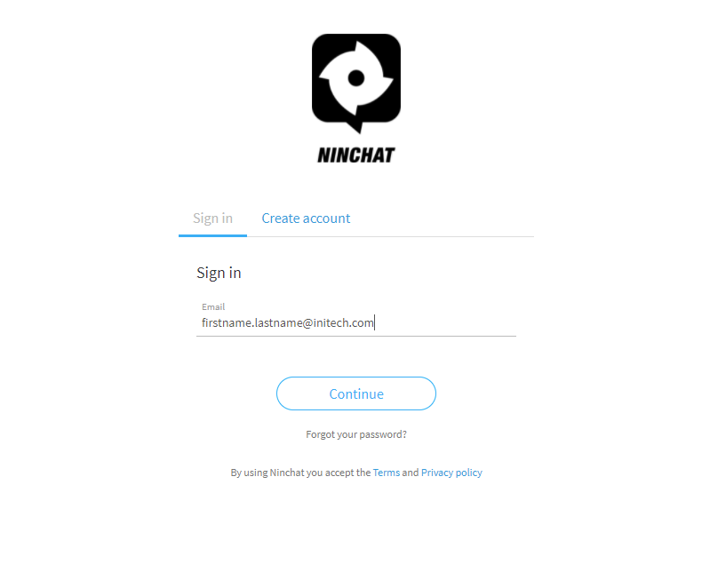

# Sign-in

## Sign-in address

**Sign in to Ninchat on** [**https://ninchat.com/app**](https://ninchat.com/app)****

You can create a bookmark in your web browser to get an easy access to Ninchat. Find instructions here:


[shortcuts-to-ninchat.md](../general-tips/shortcuts-to-ninchat.md)


## Sign-in view

### Username

Make sure that you have chosen the _Sign in_ tab.

Your Ninchat username is the email address you have registered into Ninchat with. Write your email address, e.g. _firstname.lastname@company.fi_, and continue.

### Password

Next, enter your password. The password is hidden and will be shown as dots. You can unhide the password to check the spelling by clicking the eye icon in the password field.

Click _Sign in_ to access Ninchat.

### Remember the sign-in

If you are using Ninchat on your personal device, check the box "Remember me on this device". This way you do not need to write your username and password every time you sign in, and you will be signed in automatically. Do not check this box if you are using a public or shared device!&#x20;

## Session expiration

By choosing the option "Remember me on this device", you will be automatically signed in. However, for security reason Ninchat will still ask you to enter your username and password from time to time, approximately once in a month.

## Forgot your password?

If you forgot your password, you can order a password reset link into your email address (the same you used to register into Ninchat). In sign-in view, click the link _"Forgot password?"_. See more instructions here:


[forgotten-password.md](../general-tips/forgotten-password.md)


## Problems with sign-in

If you encounter problems while signing in, you can find answers to common questions here:


[problems-signing-in.md](../general-tips/problems-signing-in.md)

