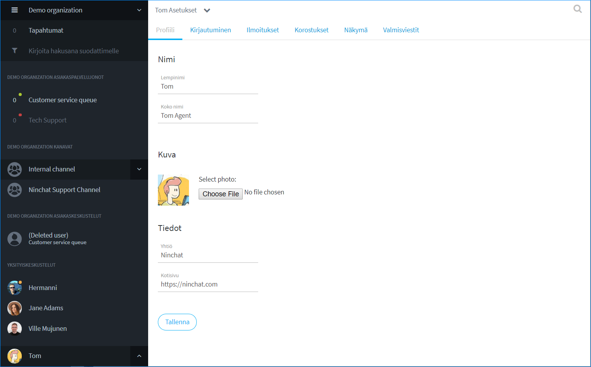
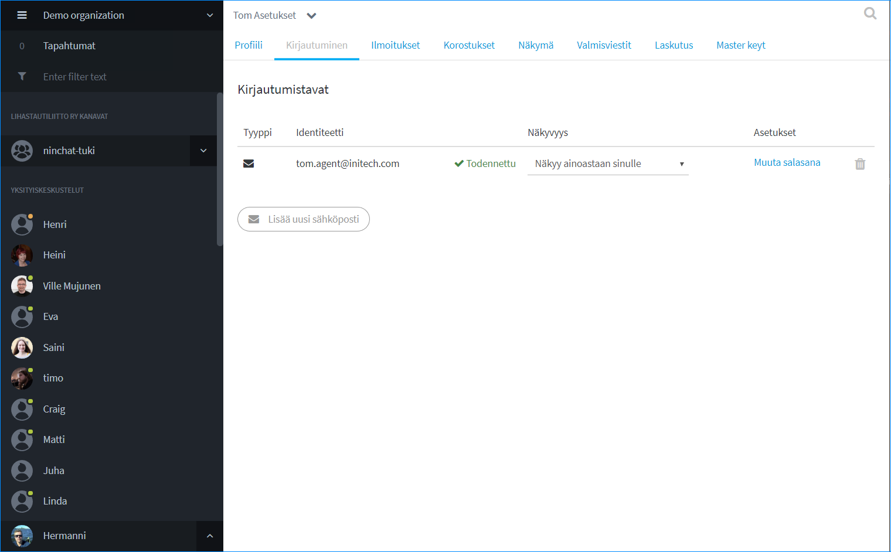
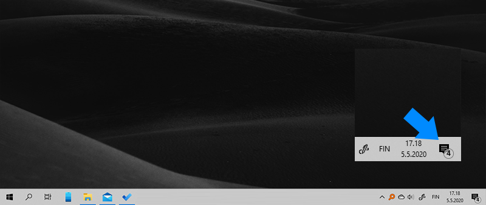
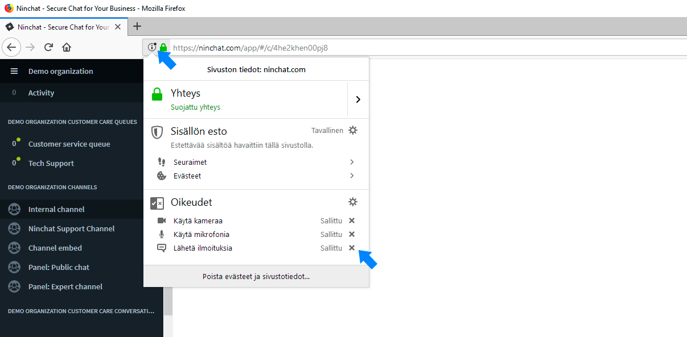
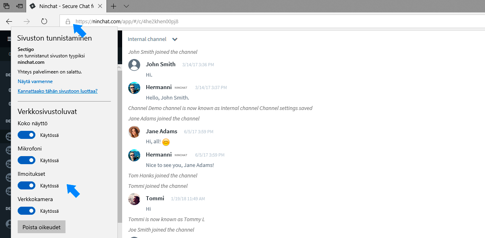
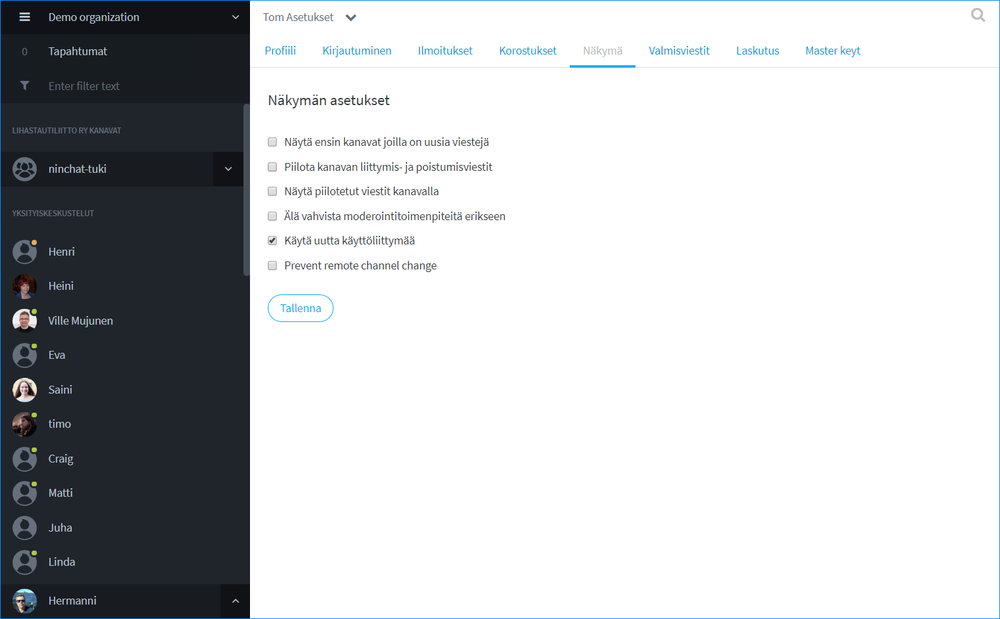
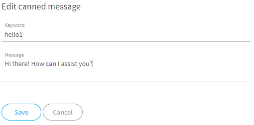

# User settings and profile

Once you have logged in to Ninchat, here is how to access your personal settings:

1. Click the arrow icon next to your name in the lower left corner.
2. An additional menu will appear,  then select "Settings and profile".
3. Your personal settings view is divided into different tabs where you can select the one you want to edit.


After editing the settings, make sure you click the "Save" button to save any changes.


## Profile

In your profile settings \("Profile" tab\), tell more about yourself so your colleagues can easily identify you.

1. Enter the name you want it to be shown to everyone in the "Screen name" field.
2. Enter your real name in the "Real name" field.
   * This is not shown e.g. to customers in customer service discussions.
   * Real name information is helpful in support situations, so we can identify you more easily. 
3. Add your profile image \(JPG or PNG file format\).
   * The image helps to identify yourself among team members.
4. Save.

## Authentication 

In the "Authentication" tab, there are some authentication methods where you can add more email addresses, set the visibility of your emails, and change your password.

### Add a new sign-in email

Your user account can have multiple email addresses for signing in. Your email address might also change and after you may want to change it for sign-in too.

Click the "Add new email" button, type a new email address and create a password for it. Add new sign-in email before you remove the previous.

### Choose visibility of your emails to others 

Under "Visibility", you can choose who can see each of your emails: only yourself \(Visible only to you\), members of your organizations \(Visible to your organizations\), or all Ninchat users \(Visible to all users\).

### Change your password

You can change your password by clicking "Change password" under Options. You will be asked to provide your old password and create a new one.

If you forgot your password, you can order a password reset link to your email from the sign-in page.

### Remove a sign-in option

You can remove a sign-in option \(email address\) by clicking the trash can icon on the right of that identity row.

Note! If you delete all of your sign-in options, you will no longer have access to your account and it will be removed. So please always keep at least one email.

### Verifying account or a sign-in option

As you register your account, you receive a verification link in your email. Before you click the verification link, your sign-in option shows up unverified. Unverified user accounts are ultimately deleted.

If you have lost the verification link email, you can order a new one on the Authentication tab. Click "_Resend verification_" link next to sign-in email. Then check your inbox and click the verification link in the email you received. If email doesn't show up, check your spam folder.

Verification link opens up Ninchat view, which tells you the verification is done. Your sign in email shows up verified in the user settings after this.

Note that verification link can be used only once. After this the link doesn't work anymore. Sign in to Ninchat normally on [https://ninchat.com/app](https://ninchat.com/app).

## Notifications

Notifications help you respond faster. In the "Notifications" tab, you can set audio and desktop notifications for different types of activities on Ninchat. You can also receive notifications via email for some types of activities.

Even when the browser window is minimized, desktop notifications can still tell you what happened. A desktop notification will appear in a corner of the window as a popup box which you can click to view the new activity on Ninchat. Read more below.

### Notification settings

**It is recommended to enable Audio and Desktop notifications for at least the following types of activities \(see the image above\):**

* **Private messages**
* **Channel highlights**
* **New person in audience queue**
* **Audience messages**

Save the changes.


Note! Notifications for "New person in audience queue" and "Person picked from queue" are only visible to agents granted with queue agent status.


### Always receive notifications

If you want to always receive audio and desktop notifications even when Ninchat is active on your screen, under "Advanced settings", check the box _"Display notifications also when not idle"_ and save. This makes it easier to track any activities.

### Desktop notifications

Desktop notifications require permission from your web browser in order to be displayed to you.

Allow the browser to display desktop notifications by clicking the "Allow" button. Notification permission is browser and device specific, so make sure to allow permissions on all browsers and devices you are using.

#### Windows operating system

Desktop notifications are displayed on the screen one by one. The rest can be found in Action center of Windows 10, until you acknowledge them. It's recommendable to clear unseen notification every once in a while from the Action center. ​[Learn more about Action Center](https://support.microsoft.com/en-gb/help/4026791/windows-how-to-open-action-center)

### Confirm desktop notifications

If you want desktop notifications to remain on screen until you confirm by clicking or closing it, under Advanced settings, check the box _"Close desktop notification only after interacting eg. mouse click"_. By doing this, the notifications will not be missed by you. 


Desktop notifications work on Google Chrome, Firefox, Safari, and Microsoft Edge browsers.   
Desktop notifications are not supported by Internet Explorer \(IE\).


#### Display a desktop notification

### Allow notifications on browsers

Once you have enabled notifications in your personal settings, you can check if desktop notifications \(as well as sound, camera, and microphone\) are allowed on your browser by clicking the lock icon in the address bar while you are on ninchat.com. Below are instructions for different browsers.

**Google Chrome**

Click the lock icon in the address bar to check permissions for the current site.

You can also adjust all notification permissions for Ninchat in Chrome browser settings by typing this in the address bar:   
chrome://settings/content/siteDetails?site=https://ninchat.com

**Mozilla Firefox**

Click the lock icon in the address bar to check permissions for the current site.

You can also adjust all notification permissions for Ninchat in Firefox browser settings by typing this in the address bar:  
about:preferences\#privacy

**Microsoft Edge**

Click the lock icon in the address bar to check permissions for the current site.

You can also adjust all notification permissions in Edge browser settings, in which you can access through the browser menu.

## Highlights

In the "Highlights" tab, check the box "Highlight your name" so that you will be notified when someone mentions you in a conversation. You can also set your own highlighting words to get notified whenever they are mentioned.

#### **How to set highlighting words?**

1. Write the words that you want them to be hightlighted, separate each word with a comma \(,\).
2. You can extend the variations of a word that starts with the same letters by adding an asterisk \(\*\) after the word e.g. Fin\*. This means the word Fin is still highlighted even when someone mentions Finland, Finnish, Finn, or Finns.
3. In the "Notifications" tab, you can also enable email notifications for Channel highlights.
4. Save.

#### **Highlighting words in a conversation**

In the image below, you can see examples of highlighting words in a conversation. A highlighting word appears with a blue background, and you will be notified whenever it is mentioned.

## View 

In the "View" tab, you can change Ninchat view in some certain areas.

#### Show channels with new activity first

Check this box if you want your conversations to be organized in the Sidebar by showing the conversations with new messages first at the top of the conversation list.

#### Hide join and part messages from channel

Check this box if you do not want to see messages telling that someone has joined/left the channel.

#### Hide name change messages on channel

Check this box if you do not want to see messages telling that someone has changed their names.

#### Show hidden messages on channel

\(For public group discussions.\) Channel moderator rights allow you to hide messages. If you want to see the hidden messages yourself, check this box.

#### Disable moderation action confirmations

Actions taken by channel moderation tools, such as hiding a message or silencing a user, normally require confirmations. Check this box if you want to disable the confirmations. \(Especially for public group discussions.\)

Be sure to save your changes.

## Canned messages

Canned messages are handy to streamline your writing with the most frequently used words or phrases. In customer chat, you can select your canned messages with a single click from the chat features, or access them with a shortcut from the message entering field.

### Create a new canned message

A canned message consists of the message itself, and keyword which individualizes it.   
E.g. "hello1" \(keyword\), "Hi there! How can I assist you?" \(message\).

1. In the "Canned messages" tab, click the "Create new message" button.

2. A new set of keyword and message will appear.  
3. Click the Edit icon \(pencil icon\), and message editor will open.

4. Enter a keyword in the Keyword field, only lowercase letters \(a-z\) and numbers are allowed, and a desired phrase in the Message field. \(Replace "key" and "message" placeholder texts.\)

5. Save.


**Note!** You can create one canned message row at a time. Create new row after you have edited the keyword and message on the new canned message row.


### Use a canned message

Instructions for using canned messages in conversations can be found in this article:



