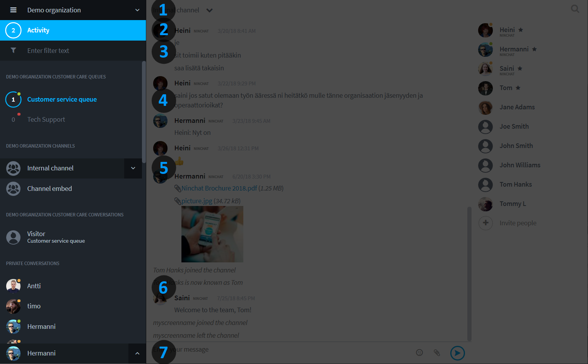

# Käyttöliittymän esittely

## Yleisnäkymä ja tiimikanava 

Ninchatin käyttöliittymä näkyy joko suomeksi tai englanniksi sen mukaan, mikä kieli web-selaimessasi on käytössä.

Ninchatin perusnäkymä koostuu kolmesta osiosta; sidebar, keskustelu ja keskustelun toiminnot.

| Sidebar                                            | Keskustelunäkymä                            | Jäsenlista                                                      |
| -------------------------------------------------- | ------------------------------------------- | --------------------------------------------------------------- |
| 
Organisaatio, kanavat ja keskustelut

 | 
Keskustelu ja viestin lähetys

 | 
Haku-toiminto, Kanavan jäsenet ja keskustelutoiminnot
 |

### Tiimikanavan tunnisteet

| Jäsenlistan merkintä                                     | Merkitys                                                                                                                       |
| -------------------------------------------------------- | ------------------------------------------------------------------------------------------------------------------------------ |
|  Tähti, umpinainen   | 
Kanavan operaattorikäyttäjä (eri kuin organisaation operaattori):

voi hallita kanavan asetuksia ja kutsua jäseniä
 |
|  Tähti, reunustettu | 
Kanavan moderaattorikäyttäjä:

voi moderoida viestejä ja poistaa jäseniä
                                           |
|  Vihreä pallo          | Käyttäjä on kirjautunut ja aktiivinen                                                                                          |
|  Oranssi pallo           | Käyttäjä on kirjautunut mutta ei aktiivinen                                                                                    |
|  Ei palloa        | Käyttäjä ei ole paikalla; hän näkee hänelle osoitetut viestit myöhemmin                                                        |
|  Kutsu väkeä      | Kutsu uusia henkilöitä kanavalle (Kanavan operaattori)                                                                         |

## Sidebar (keskustelulista)

Sivupalkin kautta siirryt keskustelujen välillä ja näet myös helposti ilmoitukset uusista tapahtumissa eri keskusteluissa.

Huomaa, että sinun ei tule poistua tiimikanavilta esim. kirjautuessasi ulos.

| Osio                    | Toiminta                                                                 |
| ----------------------- | ------------------------------------------------------------------------ |
| 1) Organisaatiot        | Organisaatiosetukset, sekä organisaation vaihto mikäli kuulut useampaan. |
| 2) Tapahtumat           | Kootusti kaikki sinua koskevat uudet tapahtumat Ninchatissa              |
| 3) Suodatus             | Suodatus/haku-palkissa voi rajata keskusteluja nimen perusteella         |
| 4) Jonot                | Asiakasjonot, joista asiakkaat poimitaan                                 |
| 5) Kanavat              | Sisäiset tiimikanavat (ja julkiset ryhmäkeskustelut)                     |
| 6) Asiakas-keskustelut  | Asiakaskeskustelut, jotka on poimittu jonoista                           |
| 7) Yksityis-keskustelut | Sisäiset, kahdenväliset yksityiskeskustelut tiimiläisten kanssa          |


Organisaatiovalikosta löytyy omien organisaatioittesi lisäksi ns. vapaa alue (Public). Tänne voivat kaikki Ninchatin käyttäjät luoda kanavia. Älä luo organisaatiosi kanavia Public-alueelle!


## Valikot

### Sidebar-menu

 -valikkoikonista voit laajentaa ja pienentää Sidebar-listan. Pienennetyssä näkymässä näet ilmoitukset ja viemällä hiiren kursorin Sidebarin päälle, näkymä laajenee automaattisesti. Pienennetty näkymä on oivallinen mm. mikäli näyttö on pienikokoinen.

.png>)

### Organisaatiovalikko

.png>)

* Organisaation asetukset
* Uuden kanavan luonti
* Muut organisaatiot joihin kuulut, sekä Yleinen alue

### Tapahtumat-valikko

Tapahtumat näyttää kootusti kaikki sinua koskevat uudet tapahtumat Ninchatissa, kuten asiakkaat jonossa, yksityisviestit, maininnat kanavilla - myös muista kuin aktiivisesta organisaatioista, mikäli kuulut useampaan.\
Klikkaamalla tapahtumariviä pääset suoraan esim. kanavalle, jossa sinua koskeva viesti on.

### Asiakasjonovalikko

Asiakasjonorivi näyttää jonot ja niiden aukiolon (vihreä pallo - jono on avoinna asiakkaille, punainen pallo - jono on suljettu), sekä jonossa olevien asiakkaiden määrän. Klikkaamalla jonon nimeä pääset Asiakasjononäkymään, ks. alempana. Nimen vieressä olevasta nuoli-ikonista taas saat avattua valikon, josta voit:

* Poimia asiakkaan jonosta
* Avata jonon asetukset (Organisaation operaattorit)
* Avata jonon tilastot (Organisaation operaattorit)
* Sulkea / avata jonon manuaalisesti

### Käyttäjävalikko

Klikkaamalla nuolta nimesi vieressä saat avattua käyttäjävalikon, jonka kautta voit:

* Avata käyttäjäasetukset
* Piilottaa/näyttää kanavan jäsenlistan oikeasta laidasta
* Vaihtaa pienen ja ison Sidebar-näkymän välillä (onnistuu myös ylhäältä .png>) -valikkokuvakkeesta)
* Näyttää/piilottaa Suodatuskentän
* Kirjautua ulos palavelusta

### Suodatus/hakukenttä 

.png>)

Mikäli sinulla on iso määrä kanavia ja keskusteluita Sidebarissa, voit suodattaa niitä nimen perusteella, ja löytää haluamasi keskustelut nopeammin.&#x20;

Kirjoita hakemasi keskustelun tai käyttäjän nimi tai osa siitä, ja keskustelulistan sisältö rajataan näihin.\
Näytä kaikki keskustelut jälleen poistamalla hakuteksti kirjoituskentästä.

## Kirjoituskenttä ja keskustelun sivupalkki 

Kirjoituskentästä voit viestin kirjoituksen lisäksi lisätä hymiöitä,  kuvia ja tiedostoja,  aloittaa videokeskustelun (asiakaskeskustelut),  piilottaa/näyttää asiakaskeskustelun sivupalkin. Lähetä viesti  -painikkeella tai \[Enter]-näppäimellä. Rivinvaihdon voit tehdä \[Vaihto]+\[Enter] -näppäimillä.

.png>)

Kanavan sivupalkissa näet kanavan jäsenet. Listalta voi aloittaa yksityiskeskusteluita. \
Kanavan operaattorit voivat listan kautta kutsua uusia jäseniä, sekä antaa käyttäjille oikeuksia.

Asiakaskeskustelun sivupalkin sisältö riippuu jonon ja käyttäjän asetuksista. Sivupalkissa voidaan näyttää metatietoja, muistiinpanokenttä, valmisviestit ja tägit.

#### Onko kanavan jäsenlista tai toimintopalsta hukassa?


[ongelmat-kayttoliittymassa.md](ongelmat-kayttoliittymassa.md)


## Asiakasjononäkymä

Asiakasjononäkymään pääset klikkaamalla jonon nimeä. Näkymästä voit poimia asiakkaat sekä näet tapahtumalokin: kuka on poiminut asiakkaita, milloin jono on avattu ja suljettu.


[asiakasjonot-ja-keskustelut](../asiakasjonot-ja-keskustelut/)


## Yksityiskeskustelut

.png>)


[yksityiskeskustelut.md](../tiimikanavat/yksityiskeskustelut.md)


## Käyttäjäasetukset


[kayttajaasetukset.md](../kayttajatili/kayttajaasetukset.md)


## Organisaation asetukset


[organisaatio](../organisaatio/)


## Ongelmatilanteet


[ongelmat-kayttoliittymassa.md](ongelmat-kayttoliittymassa.md)

