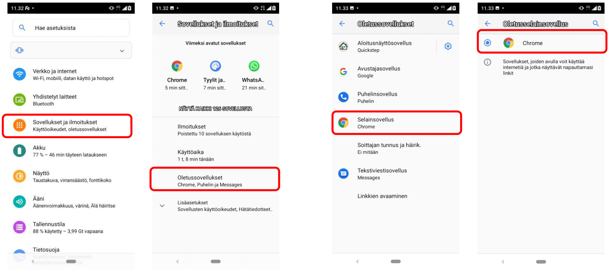

# Mobiililaitteet

## Mobiililaitteen asetukset

### Google Chromen asettaminen Android-puhelimen oletusselaimeksi 

Suosittelemme käyttämään Ninchatia Chrome-web-selaimella, niin tietokoneella kuin Android-laitteissa. Joskus tietyt puhelimet (esim. Samsung) käyttävät vakiona toista web-selainta. Voit kuitenkin vaihtaa oletusselaimen laitteen asetuksissa.

1. Avaa laitteen asetukset. Löydät ne yleensä näytön yläreunasta alaspäin vetämällä paljastuvasta ilmoitusvalikosta. Siirry asetuksiin klikkaamalla ratas-ikonia.
2. Valitse _Sovellukset ja ilmoitukset / Apps and notifications_
3. Valitse _Oletussovellukset / Default apps_
4. Klikkaa kohtaa _Selainsovellus / Browser app_ ja valitse käyttöön Chrome. Voit poistua asetuksista.

Tämän jälkeen web-linkit esim. sähköpostista avautuvat aina Chrome-selaimeen.

## Videopuhelut mobiililaitteilla

### Videopuhelutuki eri selaimilla ja alustoilla

| Alusta/käyttöjärjestelmä | Tuetut selaimet                                           |
| ------------------------ | --------------------------------------------------------- |
| Android                  | 
Google Chrome Mozilla Firefox Microsoft Edge
 |
| iOS (iPhone & iPad)      | Apple Safari                                              |

**Virheilmoitus: Videokeskustelu hylätty. Puutteellinen selaintuki.**

Tarkoittaa yleensä että asiakas on iOS-laitteella (iPhone/iPad) ja käyttää Chrome- tai Firefox-selainta. Applen rajoituksesta johtuen videopuhelut ei toimi iOSilla muilla selaimilla kuin Safari (sekä natiiveissa aplikaatioissa). Tietokoneella, myös Mac, video toimii muillakin selaimilla. 

Tai mahdollisesti asiakas Windows-laittella Internet Explorer (IE) -selain. 
