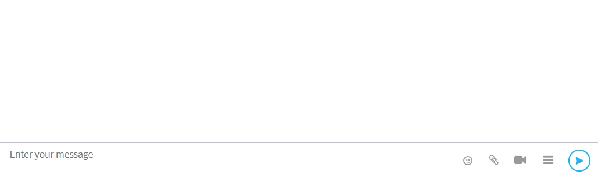

# Ongelmatilanteet käyttöliittymässä

## Kanavan jäsenlista ei näy

Kanavan jäsenlista (oikean puoleisin sivupalkki) on mahdollista pitää näkyvissä tai piilottaa. Mikäli lista ei näy, voit palauttaa sen avaamalla valikon käyttäjänimesi vieressä olevasta nuoli-kuvakkeesta vasemman palstan (Sidebar) alapäässä. Valitse valikosta "Näytä jäsenet / Show members".

## Toimintopalsta ei näy asiakaskeskusteluissa

Asiakaskeskustelun oikean laidan työkalut (muistiinpanot, valmisviestit, tägit, ...) on mahdollista näyttää tai piilottaa klikkaamalla viestinlähetyskentän vieressä olevaa-kuvaketta. Kuvake näkyy vain asiakaskeskusteluissa. 

## Käyttöliittymä on vääränkielinen 


[ninchatin-kayttaminen-suomen-kielella.md](ninchatin-kayttaminen-suomen-kielella.md)


## Windowsin työpöytäilmoitukset eivät näy

[Ohje Käyttäjäasetukset-ohjesivulla](https://support.ninchat.com/ninchat-support/kayttajatili/kayttajaasetukset#ilmoitukset-ongelmatilanteet)
