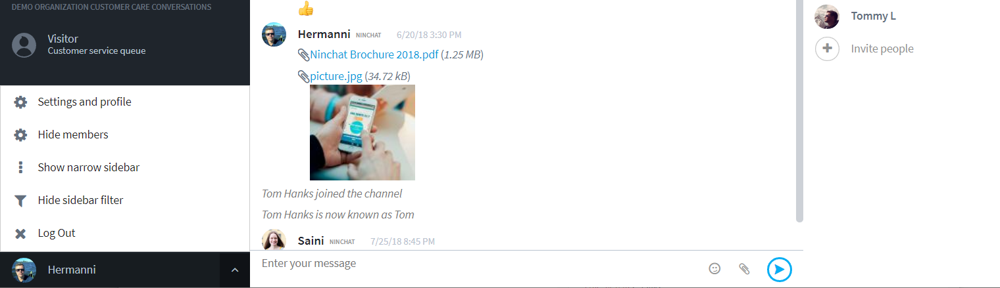
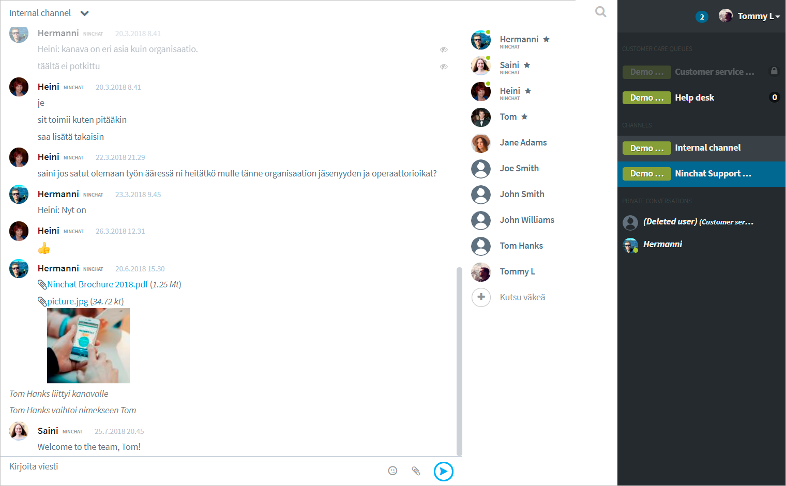
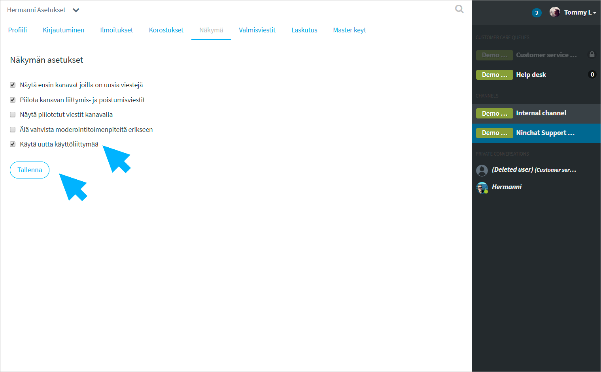

# Ongelmatilanteet käyttöliittymässä

## Kanavan jäsenlista ei näy

Kanavan jäsenlista \(oikean puoleisin sivupalkki\) on mahdollista pitää näkyvissä tai piilottaa. Mikäli lista ei näy, voit palauttaa sen avaamalla valikon käyttäjänimesi vieressä olevasta nuoli-kuvakkeesta vasemman palstan \(Sidebar\) alapäässä. Valitse valikosta "Näytä jäsenet / Show members".

## Toimintopalsta \(valmisviestit, tägit\) ei näy asiakaskeskusteluissa

Asiakaskeskustelun oikean laidan työkalut \(muistiinpanot, valmisviestit, tägit, ...\) on mahdollista näyttää tai piilottaa klikkaamalla viestinlähetyskentän vieressä olevaa -ikonia. Ikoni näkyy vain asikaskeskusteluissa.

## Käyttöliittymä rikki? 

Näetkö sisään kirjauduttuasi seuraavanlaisen näkymän – sivupalkki oikealla?

Sinulle on kytketty vahingossa vanhentunut käyttöliittymä, joka ei enää toimi kunnolla ja poistuu käytöstä. Siirry seuraavalla linkillä käyttäjäasetuksiisi: [https://ninchat.com/app/?lang=fi\#/x/settings/view](https://ninchat.com/app/?lang=fi#/x/settings/view)

Ruksaa Näkymä-asetussivulla kohta "Käytä uutta käyttöliittymää / Use new UI" ja Tallenna.  
Näkymä pitäisi nyt korjaantua.

## 

