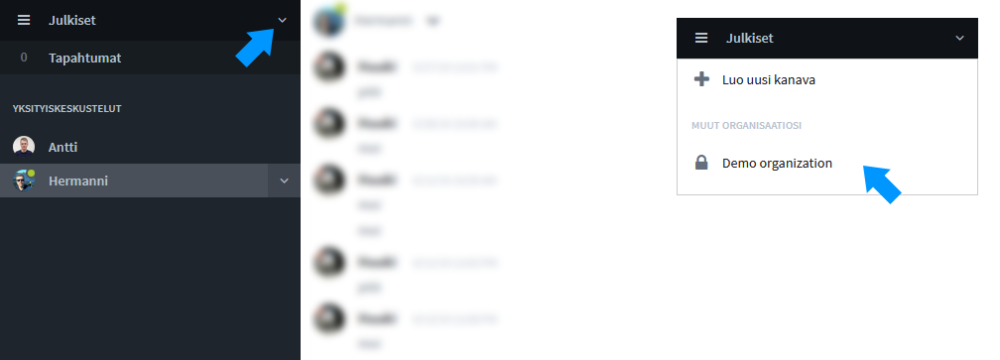

# Ongelmatilanteet sisäänkirjautumisessa

## Unohtunut salasana



## Käyttöliittymä rikki? 



## Mistä pääsen kirjautumaan palveluun?

Mikäli pikakuvake hävinnyt tai osoite on unohtunut, pääset Ninchatiin aina siirtymällä web-selaimella osoitteeseen [**https://ninchat.com/app**](https://ninchat.com/app).

## Tiimikanavia ei näy? 

Alla selitetty pari tilannetta, joissa tiimikanavia ei näy.

### Väärä organisaatio valittuna 

Mikäli sivupalkissa ei näy tuttuja kanavia ja asiakasjonoja, olet saattanut vahingossa siirtyä toiseen organisaatioon tai julkiseen tilaan.

Siirry takaisin omaan organisaatioon klikkaamalla nuolta organisaation nimen vieressä. Valitse pudotusvalikosta oma organisaationne.

### Rekisteröidyit palveluun ilman kutsulinkkiä 

Näetkö sisään kirjauduttuasi seuraavanlaisen ruudun tiimikanavan sijaan?

Olet todennäköisesti tullut Ninchatiin ilman kutsulinkkiä ja olet tilanteessa, jossa et kuulu mihinkään organisaatioon tai tiimikanavalle.

Etsi sähköpostistasi Ninchat Invite -viesti ja klikkaa sieltä kutsulinkkiä \(ks. ohje ylempänä\), tai pyydä kollegalta tai Ninchatin henkilöstöltä uusi kutsulinkki tiimikanavalle.

## Kutsulinkki ei toimi?

Kutsulinkki ei toimi ja saat virheilmoituksen yrittäessäsi hyväksyä kutsun?

Kutsu on todennäköisesti vanhentunut. Kutsulinkit ovat voimassa 14 vuorokautta. Pyydä kollegalta tai Ninchatin henkilöstöltä uusi kutsulinkki tiimikanavalle.

## Pyydä apua chatissa 

Mikäli mikään näistä neuvoista ei auttanut, voit kysyä meiltä apua asiakaspalveluchatissa.

[Avaa chat](https://ninchat.com/contact?help)

