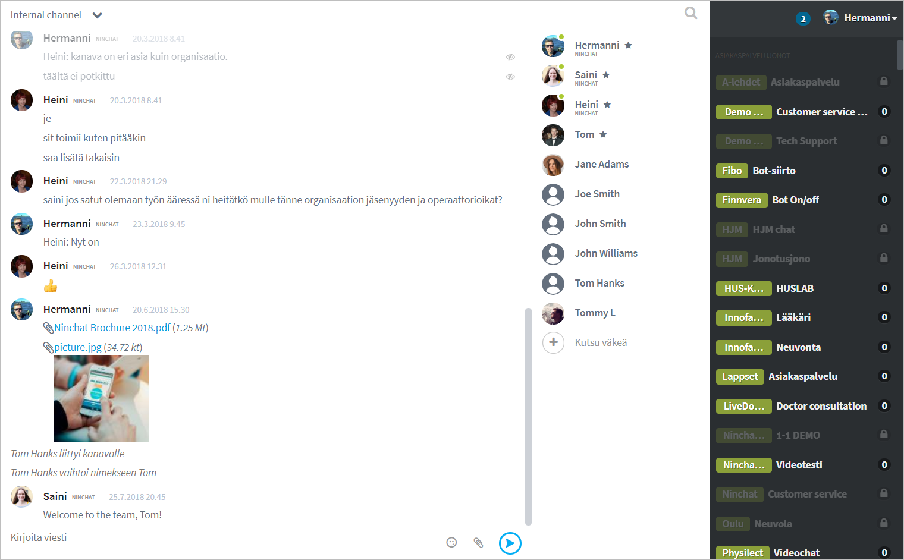
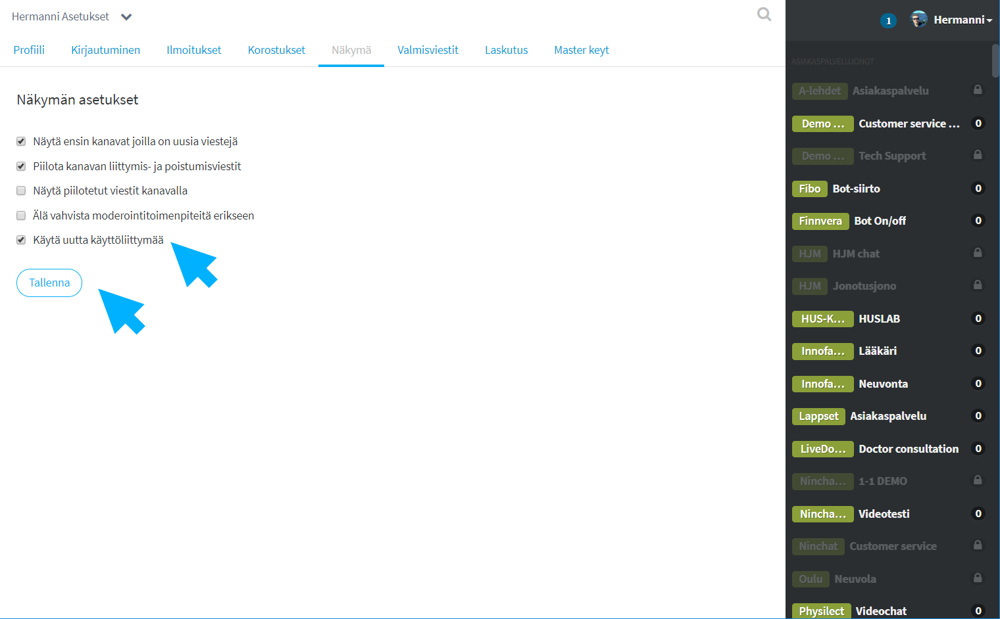

# Ongelmatilanteet käyttöliittymässä

## Käyttöliittymä rikki? 

Näetkö sisään kirjauduttuasi seuraavanlaisen näkymän - sivupalkkioikealla?

Sinulle on kytketty vahingossa vanhentunut käyttöliittymä, joka ei enää toimi kunnolla ja poistuu käytöstä. Siirry seuraavalla linkillä käyttäjäasetuksiisi: [https://ninchat.com/app/?lang=fi\#/x/settings/view](https://ninchat.com/app/?lang=fi#/x/settings/view)

Ruksaa Näkymä-asetussivulla kohta "Käytä uutta käyttöliittymää / Use new UI" ja Tallenna.  
Näkymä pitäisi nyt korjaantua.

## 

