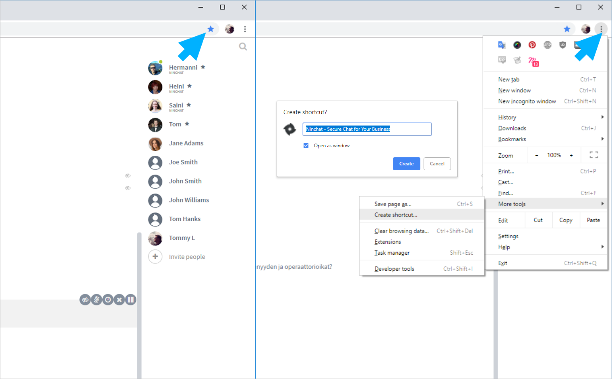
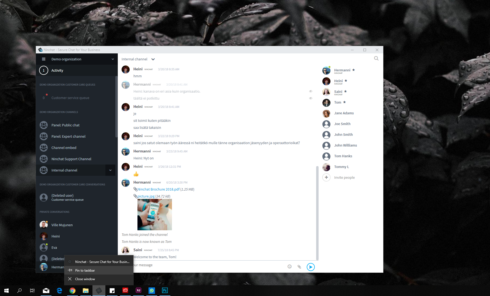
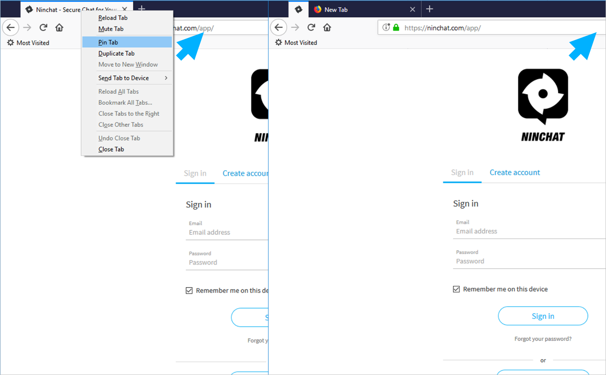
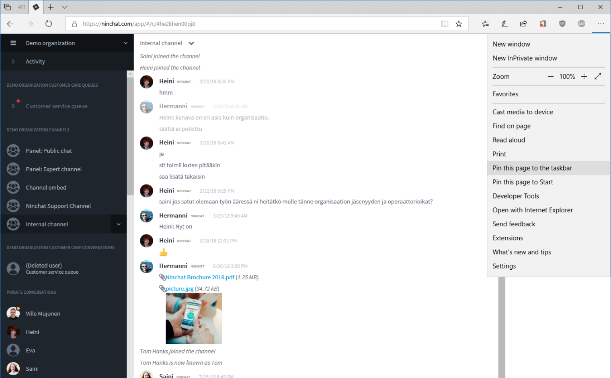

# Pikakuvakkeet Ninchatiin

## Google Chrome -selain {#google-chrome-selain}

Voit helpottaa Ninchatin käynnistämistä ja avaamista luomalla selaimen yläriville kirjanmerkin, tai tekemällä Ninchatille oman käynnistyspikakuvakkeen Windowsin työpöydälle.

#### Kirjanmerkki {#kirjanmerkki}

Lisää Ninchat kirjanmerkkeihin klikkaamalla [https://ninchat.com/app](https://ninchat.com/app/#) -sivulla tähti-ikoni selaimen osoiterivillä. Voit tallentaa kirjanmerkin kirjanmerkkipalkkiin tai kirjanmerkkivalikkoon.

#### Sovelluspikakuvake {#sovelluspikakuvake}

Voit myös ajaa Ninchatin normaalista selaimesta erillisenä sovelluksena, jonka voi myös kiinnittää tehtäväpalkkiin tai Käynnistä-valikkoon. Notifikaatiot ja muu toiminta ovat samanlaisia kuin normaalissa selainikkunassa.

1. Klikkaa valikkonappia \(kolme pistettä\).
2. Valitse Työkalut / More tools.
3. Valitse Luo pikakuvakkeita / Create Shortcut.
4. Ponnahdusikkunassa ruksaa Avaa ikkunassa / Open as window ja klikkaa Create.
5. Pikakuvake ilmestyy Työpöydälle ja voit tuplaklikkaamalla käynnistää Ninchatin.
6. Kiinnitä Ninchat Windowsin Tehtäväpalkkiin klikkaamalla kuvaketta oikealla hiiren napilla ja valitse Kiinnitä tehtäväpalkkiin / Pin to taskbar

## Mozilla Firefox -selain {#mozilla-firefox-selain}

#### Kirjanmerkin lisääminen  {#kirjanmerkin-lisaeaeminen}

Firefox ei tue erillistä työpöytä-pikakuvakkeita, mutta voit lisätä Ninchatin selaimen kirjanmerkkeihin klikkaamalla tähti-ikonia osoiterivillä. Kirjanmerkin voi lisätä kirjanmerkkipalkkiin tai -valikkoon.

#### Välilehden kiinnittäminen  {#vaelilehden-kiinnittaeminen}

Voit kiinnittää Ninchat-välilehden \(tabin\) yläriville, jolloin se pysyy aina avoinna.

1. Klikkaa välilehteä oikealla hiiren napilla
2. Valitse Kiinnitä välilehti / Pin tab.
3. Välilehti näkyy nyt pienempänä mutta pysyy aina auki valmiina.

## Microsoft Edge -selain {#microsoft-edge-selain}

Edge sallii sivuston lisäämisen kirjanmerkkeihin, sekä Windowsin tehtäväpalkkiin ja Käynnistä-valikkoon.

#### Kirjanmerkin lisääminen {#kirjanmerkin-lisaeaeminen-1}

Lisätäksesi kirjanmerkin, klikkaa tähti-ikoni osoiterivillä. Kirjanmerkin voi lisätä kirjanmerkkipalkkiin tai -valikkoon.

#### Ninchatin kiinnittäminen tehtäväpalkkiin tai Käynnistä-valikkoon {#ninchatin-kiinnittaeminen-tehtaevaepalkkiin-tai-kaeynnistae-valikkoon}

Ollessasi osoitteessa https://ninchat.com/app tai tiimikanavalla, klikkaa selaimen valikko-nappia \(kolme pistettä\) ja valitse vaihtoehdoista:

1. Kiinnitä sivu tehtäväpalkkiin / Pin this page to the taskbar. Voit tämän jälkeen käynnistää Ninchatin suoraan tehtäväpalkin kuvakkeesta
2. Kiinnitä sivu Aloitukseen / Pin this page to Start. Löydät tämän jälkeen Ninchatin ikonin Käynnistävalikon ruudukosta, josta voit sen suoraan käynnistää.

#### Välilehden kiinnittäminen {#vaelilehden-kiinnittaeminen-1}

Voit kiinnittää Ninchat-välilehden \(tabin\) yläriville, jolloin se pysyy aina avoinna.

1. Klikkaa välilehteä oikealla hiiren napilla
2. Valitse Kiinnitä välilehti / Pin tab.
3. Välilehti näkyy nyt pienempänä mutta pysyy aina auki valmiina.

## Internet Explorer \(IE\) -selain {#internet-explorer-ie-selain}

 IE mahdollistaa sivuston lisäämisen kirjanmerkkeihin, sekä Windowsin tehtäväpalkkiin.

#### Kirjanmerkin lisääminen {#kirjanmerkin-lisaeaeminen-2}

Lisätäksesi kirjanmerkin, klikkaa tähti-ikoni osoiterivillä. Kirjanmerkin voi lisätä kirjanmerkkipalkkiin tai -valikkoon.

#### Ninchatin kiinnittäminen Windowsin tehtäväpalkkiin {#ninchatin-kiinnittaeminen-windowsin-tehtaevaepalkkiin}

Internet Explorer sallii sivuston lisäämisen Windowsin tehtäväpalkkiin, josta sen voi suoraan käynnistää. Ollessasi osoitteessa https://ninchat.com/app tai tiimikanavalla, klikkaa selaimen valikko-nappia \(ratas-kuvake\).

1. Klikkaa Add site to Apps ja Ninchat-kuvake ilmestyy Windowsin tehtäväpalkkiin
2. Klikkaa kuvaketta hiiren oikealla napilla ja valitse Kiinnitä tehtäväpalkkiin / Pin to taskbar


Jos haluat, että kirjanmerkki tai pikakuvake ohjaa sinut suoraan tiimikanavallen, mene ensin kyseiselle kanavalle, ja luo sitten kirjamerkki/pikakuvake.


